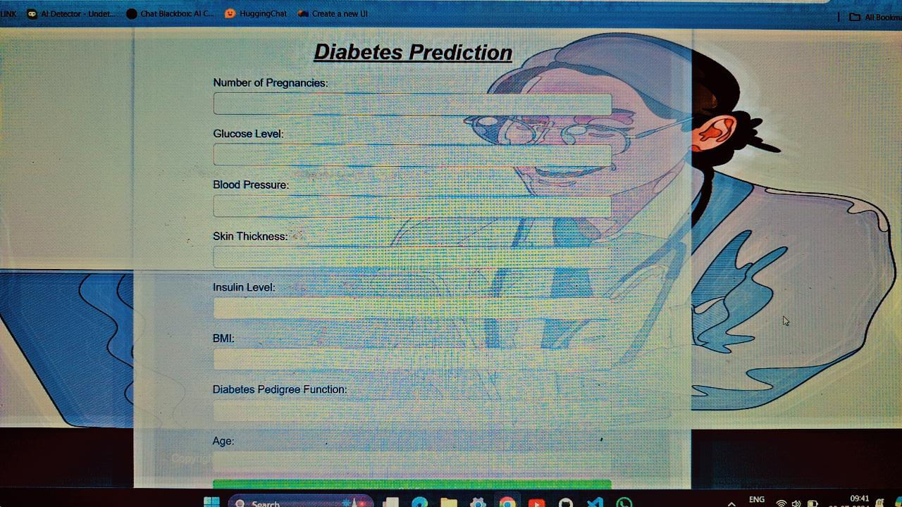
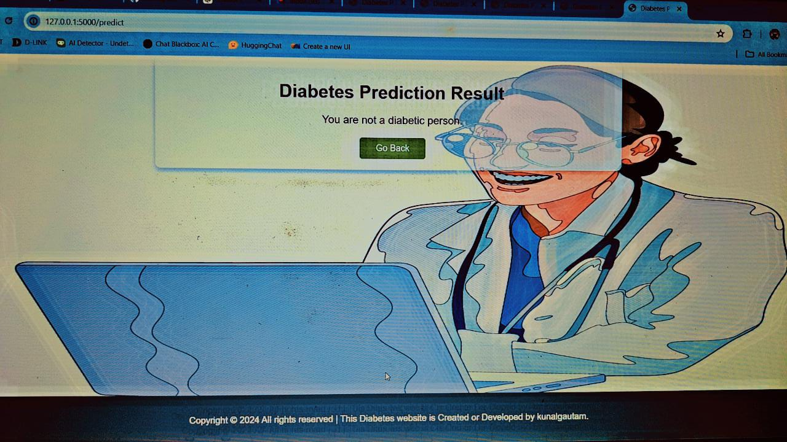

# Diabetes Prediction Model


## Table of Contents
1. [Project Overview](#project-overview)
2. [Features](#features)
3. [Installation](#installation)
4. [Usage](#usage)
5. [Technologies Used](#technologies-used)
6. [Screenshots](#screenshots)
7. [Contributing](#contributing)
8. [License](#license)
9. [Developed by](#developed-by)

## Project Overview
This project is a web-based application that predicts the likelihood of diabetes in a user based on several health metrics. The application uses a machine learning model trained on the PIMA Indian Diabetes dataset to make predictions. It is built using Flask, a lightweight web framework for Python.

## Features
- User-friendly interface for entering health data.
- Uses a trained Support Vector Machine (SVM) model for predictions.
- Displays the result of the prediction to the user.
- Responsive design, compatible with various devices.

## Installation
To get a local copy up and running, follow these steps:

1. Clone the repository:
   ```bash
   git clone https://github.com/kunal654/Diabetes-Prediction-Model.git
   cd Diabetes-Prediction-Model
   ```

2. Create a virtual environment:
   ```bash
   python -m venv venv
   ```

3. Activate the virtual environment:
   - On Windows:
     ```bash
     venv\Scripts\activate
     ```
   - On macOS/Linux:
     ```bash
     source venv/bin/activate
     ```

4. Install the required packages:
   ```bash
   pip install -r requirements.txt
   ```

5. Run the Flask application:
   ```bash
   python app.py
   ```

6. Open your web browser and navigate to `http://127.0.0.1:5000/`.

## Usage
1. Enter the required health metrics into the form on the homepage.
2. Click the "Predict" button to submit the data.
3. The result page will display whether you are likely to have diabetes or not based on the entered data.

## Technologies Used
- **Frontend:**
  - HTML5
  - CSS3
  - JavaScript

- **Backend:**
  - Python
  - Flask

- **Machine Learning:**
  - NumPy
  - Pandas
  - scikit-learn

## Screenshots
### Home Page


### Prediction Result


## Contributing
Contributions are what make the open-source community such an amazing place to learn, inspire, and create. Any contributions you make are **greatly appreciated**.

1. Fork the Project
2. Create your Feature Branch (`git checkout -b feature/AmazingFeature`)
3. Commit your Changes (`git commit -m 'Add some AmazingFeature'`)
4. Push to the Branch (`git push origin feature/AmazingFeature`)
5. Open a Pull Request

## License
Distributed under the MIT License. See `LICENSE` for more information.

## Developed by
[Kunal Gautam](https://www.linkedin.com/in/kunal-gautam-2981b2292/)  
[GitHub](https://github.com/kunal654)
